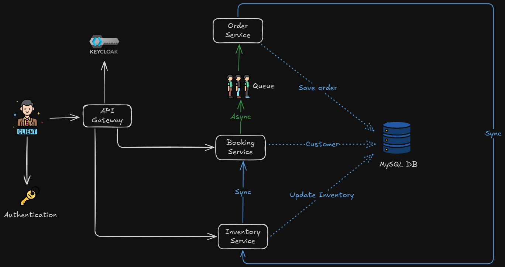
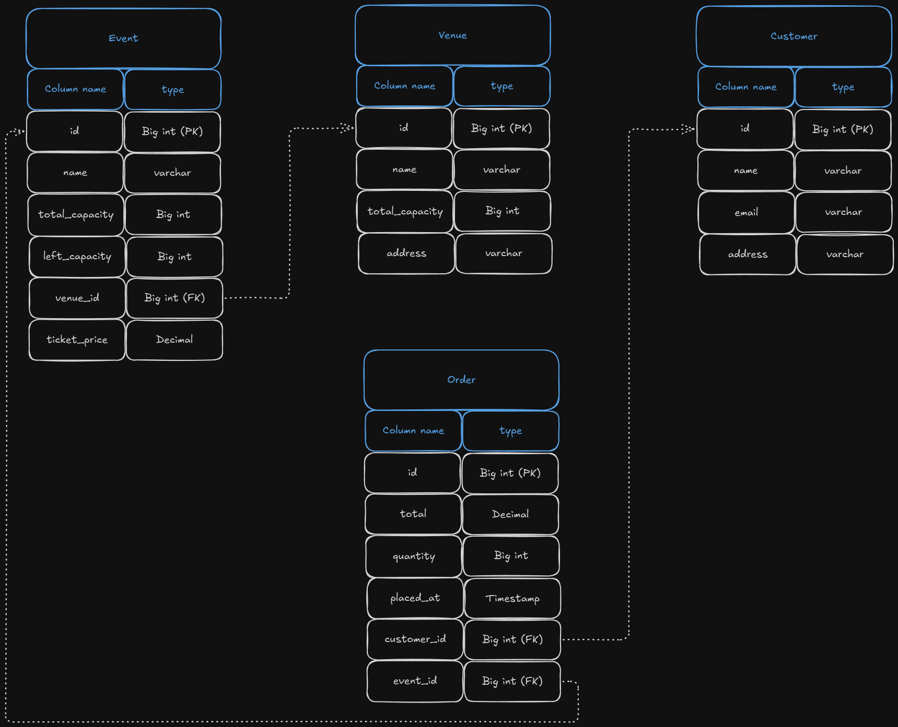

# System Architecture Overview


# Database Schema Design


# Ticket Booking System - Inventory Service

A comprehensive microservices-based ticket booking system built with Spring Boot, featuring event management, inventory tracking, and secure authentication.

## 🏗️ System Architecture

This project implements a distributed microservices architecture with the following components:

- **API Gateway** (Port 8090) - Single entry point with JWT authentication, circuit breakers, and routing
- **Inventory Service** (Port 8080) - Manages events, venues, and capacity tracking
- **Booking Service** (Port 8081) - Handles ticket reservations and publishes booking events
- **Order Service** (Port 8082) - Processes orders via Kafka events and updates inventory
- **Keycloak** (Port 8091) - Identity and access management with JWT authentication
- **Apache Kafka** (Port 9092) - Asynchronous messaging between services with event-driven architecture
- **MySQL** (Port 3306) - Shared database for all services

### Request Flow
1. Client sends authenticated request to API Gateway
2. Gateway validates JWT token with Keycloak
3. Gateway routes request to appropriate service with circuit breaker protection
4. Services communicate via REST APIs and Kafka events

### Event Flow
1. Client creates booking via API Gateway → Booking Service
2. Booking Service publishes `BookingEvent` to Kafka
3. Order Service consumes the event and creates order record
4. Order Service updates inventory capacity via Inventory Service API

## 🛠️ Technology Stack

- **Backend Framework**: Spring Boot 3.5.3
- **Java Version**: 21
- **API Gateway**: Spring Cloud Gateway (WebMVC)
- **Security**: Spring Security with OAuth2 Resource Server + JWT
- **Identity Provider**: Keycloak
- **Circuit Breaker**: Resilience4j with Spring Cloud
- **Database**: MySQL 8.3.0 (Shared across services)
- **Message Broker**: Apache Kafka with Confluent Platform
- **Inter-Service Communication**: REST APIs + Kafka Events
- **Database Migration**: Flyway
- **API Documentation**: OpenAPI 3 (Swagger) - Aggregated via Gateway
- **Monitoring**: Spring Actuator with Circuit Breaker Health Indicators
- **Containerization**: Docker & Docker Compose
- **Build Tool**: Maven

## 📊 Database Schema

The system uses the following entities with relationships:

### Event Entity
- `id` (Primary Key)
- `name` - Event name
- `total_capacity` - Maximum tickets available
- `left_capacity` - Remaining tickets
- `venue_id` (Foreign Key) - Associated venue
- `ticket_price` - Price per ticket

### Venue Entity
- `id` (Primary Key)
- `name` - Venue name
- `address` - Venue location
- `total_capacity` - Venue capacity

### Customer Entity
- `id` (Primary Key)
- `name` - Customer name
- `email` - Customer email
- `address` - Customer address

### Order Entity
- `id` (Primary Key)
- `total` - Order total amount
- `quantity` - Number of tickets
- `placed_at` - Order timestamp
- `customer_id` (Foreign Key)
- `event_id` (Foreign Key)

## 🚀 Getting Started

### Prerequisites

- Java 21
- Maven 3.6+
- Docker and Docker Compose
- Git

### Installation

1. **Clone the repository**
   ```bash
   git clone https://github.com/QZXsim/Ticket-booking.git
   cd ticket-booking-system
   ```

2. **Start infrastructure services**
   ```bash
   cd inventory-service
   docker-compose up -d
   ```

   This will start:
   - MySQL database (Port 3306)
   - Kafka ecosystem (Kafka: 9092, Zookeeper: 2181, Schema Registry: 8083)
   - Kafka UI (Port 8084)
   - Keycloak (Port 8091)
   - Keycloak MySQL database

3. **Configure Keycloak**
   - Access Keycloak Admin Console: http://localhost:8091
   - Login with: admin/admin
   - Import realm configuration from `/docker/keycloak/realms/`

4. **Run the services**
   
   **Inventory Service:**
   ```bash
   cd inventory-service
   mvn clean install
   mvn spring-boot:run
   ```
   
   **Booking Service:**
   ```bash
   cd booking-service
   mvn clean install
   mvn spring-boot:run
   ```
   
   **Order Service:**
   ```bash
   cd order-service
   mvn clean install
   mvn spring-boot:run
   ```

5. **Verify the setup**
   - Inventory Service: http://localhost:8080
   - Booking Service: http://localhost:8081
   - Order Service: http://localhost:8082
   - Inventory Swagger UI: http://localhost:8080/swagger-ui.html
   - Booking Swagger UI: http://localhost:8081/swagger-ui.html
   - Kafka UI: http://localhost:8084

## 🔧 Configuration

### Configuration Details

**API Gateway (application.properties):**
```properties
spring.application.name=api-gateway
server.port=8090

# Security Configuration
keycloak.auth.jwk-set-uri=http://localhost:8091/realms/ticketing-security-realm/protocol/openid-connect/certs
spring.security.oauth2.resourceserver.jwt,issuer-uri=http://localhost:8091/realms/ticketing-security-realm
security.excluded.urls=/swagger-ui.html,/swagger-ui/**,/docs/**,/v3/api-docs/**,/swagger-resources/**,/api-docs/**

# Unified API Documentation
springdoc.swagger-ui.urls[0].name=Inventory Service
springdoc.swagger-ui.urls[0].url=/docs/inventoryservice/v3/api-docs
springdoc.swagger-ui.urls[1].name=Booking Service
springdoc.swagger-ui.urls[1].url=/docs/bookingservice/v3/api-docs

# Circuit Breaker Configuration
resilience4j.circuitbreaker.configs.default.failureRateThreshold=50
resilience4j.circuitbreaker.configs.default.slidingWindowSize=8
resilience4j.circuitbreaker.configs.default.waitDurationInOpenState=5s
management.endpoints.web.exposure.include=*
```

**Inventory Service (application.properties):**
```properties
spring.application.name=inventory-service
server.port=8080
spring.datasource.url=jdbc:mysql://localhost:3306/ticketing
spring.jpa.hibernate.ddl-auto=none
springdoc.swagger-ui.path=/swagger-ui.html
```

**Booking Service (application.properties):**
```properties
spring.application.name=booking-service
server.port=8081
spring.datasource.url=jdbc:mysql://localhost:3306/ticketing
inventory.service.url=http://localhost:8080/api/v1/inventory
spring.kafka.bootstrap-servers=localhost:9092
spring.kafka.template.default-topic=booking
spring.kafka.producer.value-serializer=org.springframework.kafka.support.serializer.JsonSerializer
```

**Order Service (application.properties):**
```properties
spring.application.name=order-service
server.port=8082
spring.datasource.url=jdbc:mysql://localhost:3306/ticketing
inventory.service.url=http://localhost:8080/api/v1/inventory
spring.kafka.bootstrap-servers=localhost:9092
spring.kafka.consumer.group-id=order-booking-group
spring.kafka.consumer.value-deserializer=org.springframework.kafka.support.serializer.JsonDeserializer
spring.kafka.consumer.properties.spring.json.type.mapping=bookingEvent:com.spring.ticketbooking.booking_service.event.BookingEvent
```

### Environment Variables

For production deployment, override the following environment variables:

- `MYSQL_HOST` - Database host
- `MYSQL_PORT` - Database port  
- `MYSQL_DATABASE` - Database name
- `MYSQL_USERNAME` - Database username
- `MYSQL_PASSWORD` - Database password
- `KAFKA_BOOTSTRAP_SERVERS` - Kafka broker endpoints
- `KEYCLOAK_SERVER_URL` - Keycloak server URL
- `INVENTORY_SERVICE_URL` - Inventory service URL for inter-service communication

## 📚 API Documentation

### API Gateway Routes (Port 8090) - Main Entry Point

| Method | Gateway Endpoint | Target Service | Description |
|--------|-----------------|----------------|-------------|
| GET | `/api/v1/inventory/events` | Inventory Service | Get all available events |
| GET | `/api/v1/inventory/event/{eventId}` | Inventory Service | Get specific event inventory |
| GET | `/api/v1/inventory/venue/{venueId}` | Inventory Service | Get venue information |
| PUT | `/api/v1/inventory/event/{eventId}/capacity/{capacity}` | Inventory Service | Update event capacity |
| POST | `/api/v1/booking` | Booking Service | Create a new booking |

### Security
- All endpoints require JWT authentication except excluded URLs
- JWT tokens validated against Keycloak JWK endpoint
- Excluded URLs: Swagger UI, API docs, health checks

### Circuit Breaker Protection
- **Booking Service**: Protected with `bookingServiceCircuitBreaker`
- **Fallback**: Returns HTTP 503 when service is unavailable
- **Configuration**: 50% failure rate threshold, 8-request sliding window

### Service Discovery
Individual services are also accessible directly:

**Inventory Service Endpoints (Port 8080):**
- GET `/api/v1/inventory/events`
- GET `/api/v1/inventory/event/{eventId}`  
- GET `/api/v1/inventory/venue/{venueId}`
- PUT `/api/v1/inventory/event/{eventId}/capacity/{capacity}`

**Booking Service Endpoints (Port 8081):**
- POST `/api/v1/booking`

**Order Service (Port 8082):**
- Event-driven consumer (no REST endpoints)
- Listens to `booking` Kafka topic
- Automatically processes booking events

### Kafka Events

The system publishes the following events:

**BookingEvent** - Published by Booking Service when a booking is created
```json
{
  "userId": 1,
  "eventId": 1,
  "ticketCount": 2,
  "totalPrice": 199.98
}
```

**Event Flow:**
1. Booking Service → Publishes `BookingEvent` to `booking` topic
2. Order Service → Consumes event from `order-booking-group` consumer group
3. Order Service → Creates order and updates inventory via REST API

### Example API Responses

**Get All Events**
```json
[
  {
    "id": 1,
    "name": "Concert Night",
    "totalCapacity": 1000,
    "leftCapacity": 750,
    "venue": {
      "id": 1,
      "name": "Main Arena",
      "address": "123 Main St"
    },
    "ticketPrice": 99.99
  }
]
```

**Get Event Inventory**
```json
{
  "id": 1,
  "name": "Concert Night",
  "totalCapacity": 1000,
  "leftCapacity": 750,
  "venue": {
    "id": 1,
    "name": "Main Arena",
    "address": "123 Main St",
    "totalCapacity": 1000
  },
  "ticketPrice": 99.99
}
```

## 🏗️ Project Structure

```
inventory-service/
├── config/
│   └── OpenApiConfig.java
├── controller/
│   └── InventoryController.java
├── entity/
│   ├── Event.java
│   └── Venue.java
├── repository/
│   ├── EventRepository.java
│   └── VenueRepository.java
├── response/
│   ├── EventInventoryResponse.java
│   └── VenueInventoryResponse.java
├── service/
│   └── InventoryService.java
├── InventoryServiceApplication.java
├── resources/
│   ├── db.migration/
│   │   ├── V1__init.sql
│   │   ├── V2__add_ticket_column_in_event_table.sql
│   │   ├── V3__create_customer_table.sql
│   │   └── V4__create_order_table.sql
│   ├── static/
│   ├── templates/
│   └── application.properties
├── docker/
│   ├── keycloak/
│   │   └── realms/
│   └── mysql/
│       └── init.sql
├── docker-compose.yml
├── Dockerfile
├── pom.xml
└── README.md

booking-service/
├── client/
│   └── InventoryServiceClient.java
├── config/
│   └── OpenApiConfig.java
├── controller/
│   └── BookingController.java
├── entity/
│   └── Customer.java
├── event/
│   └── BookingEvent.java
├── repository/
│   └── CustomerRepository.java
├── request/
│   └── BookingRequest.java
├── response/
│   ├── BookingResponse.java
│   ├── InventoryResponse.java
│   └── VenueResponse.java
├── service/
│   └── BookingService.java
├── BookingServiceApplication.java
├── resources/
│   ├── static/
│   ├── templates/
│   └── application.properties
├── Dockerfile
├── pom.xml
└── README.md

order-service/
├── booking_service/
│   └── event/
│       └── BookingEvent.java
├── client/
│   └── InventoryServiceClient.java
├── entity/
│   └── Order.java
├── repository/
│   └── OrderRepository.java
├── service/
│   └── OrderService.java
├── OrderServiceApplication.java
├── resources/
│   ├── static/
│   ├── templates/
│   └── application.properties
├── Dockerfile
├── pom.xml
└── README.md

api-gateway/
├── config/
│   └── SecurityConfig.java
├── route/
│   ├── BookingServiceRoutes.java
│   └── InventoryServiceRoutes.java
├── ApiGatewayApplication.java
├── resources/
│   └── application.properties
├── Dockerfile
├── pom.xml
└── README.md
```

## 🔐 Security

The system implements comprehensive security measures:

### JWT Authentication
- **Token Validation**: All requests validated against Keycloak JWK endpoint
- **Stateless Security**: JWT tokens contain user claims and roles
- **Token Issuer**: Keycloak realm: `ticketing-security-realm`
- **JWK Set URI**: `http://localhost:8091/realms/ticketing-security-realm/protocol/openid-connect/certs`

### API Gateway Security
- **Centralized Authentication**: All requests go through gateway security filter
- **Excluded Endpoints**: Documentation and health check endpoints are public
- **OAuth2 Resource Server**: Spring Security integration with Keycloak

### Keycloak Configuration
- **Admin Console**: http://localhost:8091
- **Default Credentials**: admin/admin
- **Realm**: `ticketing-security-realm`
- **Client Configuration**: Import from `/docker/keycloak/realms/`

### Security Flow
1. Client obtains JWT token from Keycloak
2. Client sends request with `Authorization: Bearer <token>` header
3. API Gateway validates token against Keycloak JWK endpoint
4. Valid requests are forwarded to backend services
5. Invalid/missing tokens receive 401 Unauthorized response

## 🚀 Circuit Breaker & Resilience

The API Gateway implements resilience patterns to handle service failures gracefully:

### Circuit Breaker Configuration
- **Pattern**: Circuit Breaker with fallback responses
- **Library**: Resilience4j
- **Failure Rate Threshold**: 50%
- **Sliding Window**: 8 requests (COUNT_BASED)
- **Wait Duration**: 5 seconds in open state
- **Minimum Calls**: 4 calls before evaluation

### Fallback Mechanisms
- **Booking Service**: Returns HTTP 503 with "Booking service is down" message
- **Timeout Configuration**: 3-second timeout for service calls
- **Retry Policy**: Maximum 3 attempts with 2-second wait duration

### Health Monitoring
- **Actuator Integration**: Circuit breaker health indicators enabled
- **Endpoints**: `/actuator/health` shows circuit breaker states
- **Metrics**: All actuator endpoints exposed for monitoring

### Resilience4j Properties
```properties
# Circuit Breaker
resilience4j.circuitbreaker.configs.default.failureRateThreshold=50
resilience4j.circuitbreaker.configs.default.slidingWindowSize=8
resilience4j.circuitbreaker.configs.default.waitDurationInOpenState=5s
resilience4j.circuitbreaker.configs.default.automaticTransitionFromOpenToHalfOpenEnabled=true

# Timeout & Retry
resilience4j.timelimiter.configs.default.timeout-duration=3s
resilience4j.retry.configs.default.max-attempts=3
resilience4j.retry.configs.default.wait-duration=2s
```

## 📨 Messaging Architecture

The system uses Apache Kafka for asynchronous communication with the following pattern:

### Kafka Topics & Consumer Groups
- **Topic**: `booking`
- **Producer**: Booking Service
- **Consumer**: Order Service (Consumer Group: `order-booking-group`)

### Message Flow
1. **Booking Creation**: Client sends booking request to Booking Service
2. **Event Publishing**: Booking Service validates and publishes `BookingEvent` to Kafka
3. **Order Processing**: Order Service consumes event and creates order record
4. **Inventory Update**: Order Service calls Inventory Service REST API to update capacity
5. **Transaction Completion**: Order is persisted with timestamp

### Event Schema
```java
public class BookingEvent {
    private Long userId;        // Customer ID
    private Long eventId;       // Event being booked
    private Long ticketCount;   // Number of tickets
    private BigDecimal totalPrice; // Total booking amount
}
```

### Kafka Configuration
- **Serialization**: JSON serialization for event payloads
- **Consumer Group**: Ensures only one Order Service instance processes each event
- **Type Mapping**: Automatic deserialization to BookingEvent objects

## 📊 Monitoring

- **API Gateway Health**: http://localhost:8090/actuator/health - Shows circuit breaker states
- **Circuit Breaker Metrics**: http://localhost:8090/actuator/circuitbreakers
- **Kafka UI**: http://localhost:8084 - Monitor Kafka topics and messages
- **Unified Swagger UI**: http://localhost:8090/swagger-ui.html - All services API documentation
- **Keycloak Admin Console**: http://localhost:8091 - User and realm management
- **Individual Service Health**: 
  - Inventory: http://localhost:8080/actuator/health
  - Booking: http://localhost:8081/actuator/health
  - Order: http://localhost:8082/actuator/health

## 📄 License

This project is licensed under the MIT License - see the LICENSE file for details.

## 📋 Summery

- [x] **Microservices Architecture** - Inventory, Booking, Order services
- [x] **API Gateway** - Single entry point with routing and security
- [x] **JWT Authentication** - Keycloak integration with OAuth2
- [x] **Event-Driven Architecture** - Kafka messaging between services
- [x] **Circuit Breaker Pattern** - Resilience4j for fault tolerance
- [x] **Unified API Documentation** - Aggregated Swagger UI via Gateway
- [x] **Database Migrations** - Flyway for schema versioning
- [x] **Docker Containerization** - Complete infrastructure setup
